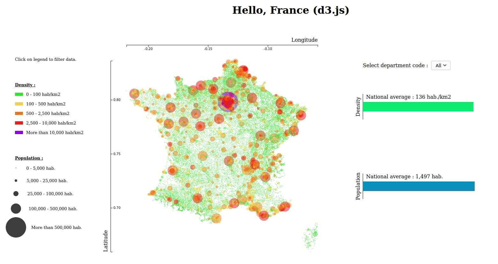

# Demographic analysis of France with the d3.js framework

  

This project aims to take the d3.js framework applied to data visualization. The data presented here correspond to demographic information of the French population. Some data are missing or incorrect but are kept as it is, without cleaning phase of the data. It is simply a question here of doing a visualization work.

The choice of visualization adopted here is to let a maximum of possibility to the user to explore by himself the data by putting the accent on the interaction.
Here the user can interact with the legend to select subsamples of cities based on their population or density. It is also possible to visualize the average population and average density per city according to the department compared to the national values. 
